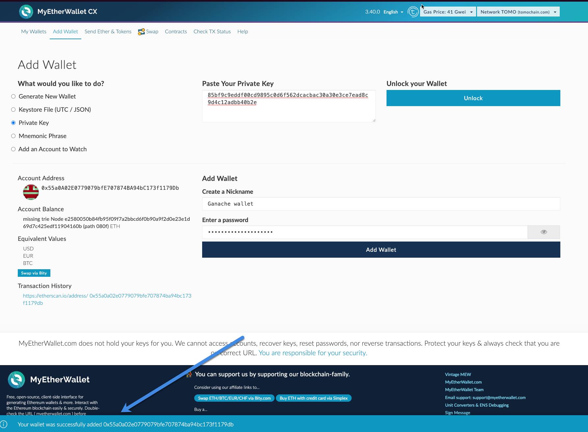

# Blockchain -  Proof of concept Smart Contracts 
## Table of contents.
- [Introduction](#introduction)
- [Testing Simple smart contract.](#testing-simple-smart-contract)
  * [Creating the contract](#creating-the-contract)
    + [Remix ethereum compiler:](#remix-ethereum-compiler-)
  * [Installing the MyEthereumWallet](#installing-the-myethereumwallet)
  * [Adding Ganache mockup wallet.](#adding-ganache-mockup-wallet)
  * [Deploying the contract.](#deploying-the-contract)
  * [Interacting with the contract.](#interacting-with-the-contract)
    + [Setting the values for id and name.](#setting-the-values-for-id-and-name)
    + [Getting the values for id and name.](#getting-the-values-for-id-and-name)
    + [Transaction evidences in ganache.](#transaction-evidences-in-ganache)
- [Using Geth Ethereum](#using-geth-ethereum)

## Introduction
Along this simple repository I've done a proof of concept about Smart contracts using blockchain. First section creates and deploys a contract in a local instnace using Ganache [Testing Simple smart contract.](#testing-simple-smart-contract).

The second section uses Geth Ethereum to connect my ether wallet to a local instance of the Blockchain: [Using Geth Ethereum](#using-geth-ethereum).

All the information here it's mocked and the tools used are meant to be tested in local environments. Toolset:

- [Ethereum wallet v3.4.0](https://github.com/MyEtherWallet/etherwallet/releases/tag/v3.40.0)
- [Ganache](https://www.trufflesuite.com/ganache)
- [Remix Ethereum online editor](https://remix.ethereum.org)
- [Geth Go Ethereum](https://geth.ethereum.org/docs/install-and-build/installing-geth)

## Testing Simple smart contract.

### Creating the contract
A simple contract was defined in the [SimpleContract](contracts/SingleContract.sol) as shown below.

This contract only sets two attributes: `id` and `name` with it's accessors getters and setters.

This contract was deployed using Remix Ethereum online editor to speed up the process and avoid to compile it locally. The ABI files and the bytecode was extracted from the online editor.

- [ABI](contracts/gensrc/SimpleContractABI.json)
- [Bytecode](contracts/gensrc/SimpleContractBytecode.txt)

#### Remix ethereum compiler:

### Installing the MyEthereumWallet

The deprecated version of the Ethereum wallet chrome plugin was installed, mainly because new versions of the plugin doesn't allow to connect to localhost instances to deploy the contrats or use localhost mocked wallets.

### Adding Ganache mockup wallet.
Mockup wallet with 100 ethers to be able to transact with the contract:

My ether wallets your wallets:

### Deploying the contract.
With the [Bytecode](contracts/gensrc/SimpleContractBytecode.txt) attribute called `object` is added to deploy the contract in ether wallet.

### Interacting with the contract.

#### Setting the values for id and name.
Setting the value of `123456` for the attribute `id`

Setting the value of `Roger` for the attribute `Name`

#### Getting the values for id and name.

Getting the value of the attribute `id`

Getting the value of the attribute `Name`

#### Transaction evidences in ganache.

Wallet transactions discounted:

Blockchain transactions:

Transaction detail.

## Using Geth Ethereum

The idea behind this section is to connect my ether wallet to a local instance of the blockchain, using Geth Ethereum.

### Generating `Genesis.json`

First the directory  was created to generate the geth local ethereum instance. and after that the file  was created, from the repository: https://gist.github.com/0mkara/b953cc2585b18ee098cd 

