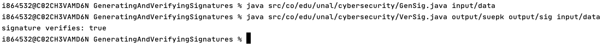

# Generating and verifying signatures.
This project is the implementation of the Oracle's tutorial: https://docs.oracle.com/javase/tutorial/security/apisign/index.html.
Was imported and generated in IntelliJ IDEA, however can be run in console as shown below.

## Sign of the file and signature generation.
### Run in Console:

`java src/co/edu/unal/cybersecurity/GenSig.java input/data`

- Data File `input/data`
- Main class `co.edu.unal.cybersecurity.GenSig`

### Output files:

- Signature file `output/sig`
- Public key `output/suepk`

## Verifying.

### Console
`java src/co/edu/unal/cybersecurity/VerSig.java output/suepk output/sig input/data`

- Original File `input/data`
- Signature file `output/sig`
- Public key `output/suepk`
- Screenshot evidence `output/ScreenshotEvidence.png`

### Evidence
```
i864532@C02CH3VAMD6N GeneratingAndVerifyingSignatures % java src/co/edu/unal/cybersecurity/GenSig.java input/data
i864532@C02CH3VAMD6N GeneratingAndVerifyingSignatures % java src/co/edu/unal/cybersecurity/VerSig.java output/suepk output/sig input/data
signature verifies: true
i864532@C02CH3VAMD6N GeneratingAndVerifyingSignatures % 
```


