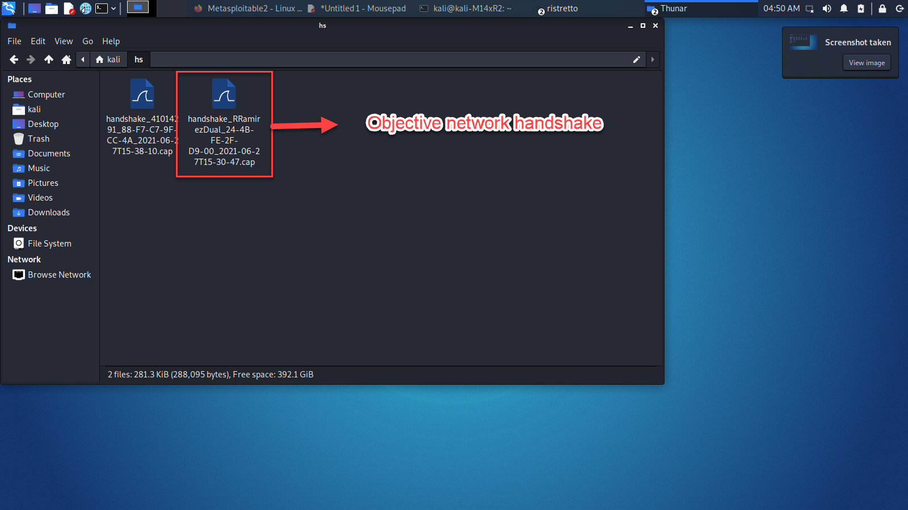
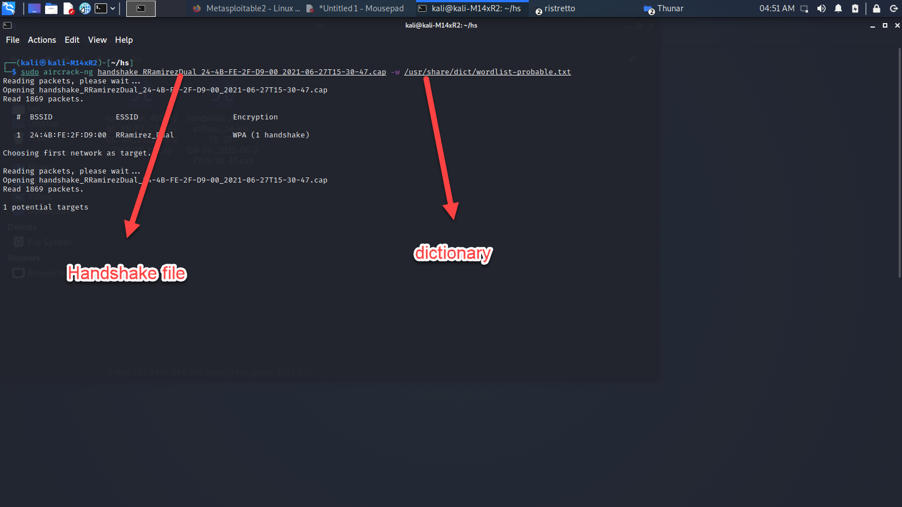
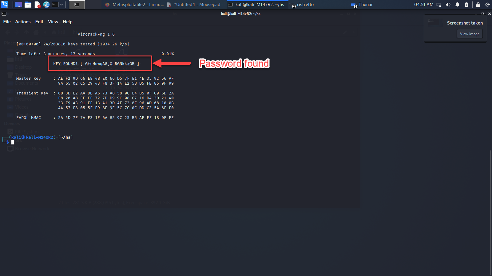

# Ethical Hacking using Kali Linux
Roger Ramírez Espejo.<br />
Software engineer, architect and enthusiast. <br />
Cybersecurity Project - Kali linux workshop
## Table of contents.


## Introduction.
This project shows the usage of several tools provided by [Kali linux](https://www.kali.org/), which help to evaluate the security of our technology appliances. In this workshop there were used the following versions of Kali Linux:

<kbd></kbd>

- [Bare Metal](https://www.kali.org/get-kali/#kali-bare-metal): Installable version which was installed in an old laptop. This version was used to execute the Wifi cracking section.
- [Virtual Box - VM](https://www.kali.org/get-kali/#kali-virtual-machines): Virtual box version of the operative system. Used to execute the rest of the project except the Wifi cracking section.
- [Metasploitable - VM](): Vulnerable Server which will be during the workshop to show common vulnerabilities of the servers, displayed by the tools used here.

### Metasploitable download and startup

Metasploitable download page: https://sourceforge.net/projects/metasploitable/
<br />
<kbd></kbd>

<br />
<br />

Vulnerable server configuration on `192.168.50.91`:
<br />
<kbd></kbd>

<br />

### Disclaimer
This Workshop and it's results were performed only for educational purposes. Any misusage of the information of this report is not responsibility of the author. Discretion is advised.

Depending on the time of reading of this report some features might changed or replaced by different tools.

## Information Gathering.
This section shows the following tools:

- [Dmitry](https://tools.kali.org/information-gathering/dmitry): DMitry (Deepmagic Information Gathering Tool) is a UNIX/(GNU)Linux Command Line Application coded in C. DMitry has the ability to gather as much information as possible about a host. Base functionality is able to gather possible subdomains, email addresses, uptime information, tcp port scan, whois lookups, and more. 
- [DNSEnum](https://tools.kali.org/information-gathering/dnsenum): Multithreaded perl script to enumerate DNS information of a domain and to discover non-contiguous ip blocks.
- [Nmap](https://nmap.org/): Mapping appliance which display the details of the devices connected to the current network.
- [Whatweb](https://tools.kali.org/web-applications/whatweb): WhatWeb identifies websites. Its goal is to answer the question, “What is that Website?”. WhatWeb recognises web technologies including content management systems (CMS), blogging platforms, statistic/analytics packages, JavaScript libraries, web servers, and embedded devices. WhatWeb has over 1700 plugins, each to recognize something different. WhatWeb also identifies version numbers, email addresses, account IDs, web framework modules, SQL errors, and more.

These tools are located under information gathering section in start menu in kali linux:

<kbd></kbd>
<br />
<br />

### Deepmagic for reconnaissance
The objective of this section is to explore the server information of sites such as [Rappi.com](https://rappi.com) and [Yahoo.com](https://yahoo.com) in order to reconnaisse their DNS information:

Command below will help to gather as much information as possible about the host [Rappi.com](https://rappi.com)
```
dmtry rappi.com
```
Domain name information:
```
  Domain Name: RAPPI.COM
   Registry Domain ID: 87997065_DOMAIN_COM-VRSN
   Registrar WHOIS Server: whois.godaddy.com
   Registrar URL: http://www.godaddy.com
   Updated Date: 2021-01-19T21:04:12Z
   Creation Date: 2002-06-30T06:54:15Z
   Registry Expiry Date: 2026-06-30T06:59:38Z
   Registrar: GoDaddy.com, LLC
   Registrar IANA ID: 146
   Registrar Abuse Contact Email: abuse@godaddy.com
   Registrar Abuse Contact Phone: 480-624-2505
   Domain Status: clientDeleteProhibited https://icann.org/epp#clientDeleteProhibited
   Domain Status: clientRenewProhibited https://icann.org/epp#clientRenewProhibited
   Domain Status: clientTransferProhibited https://icann.org/epp#clientTransferProhibited
   Domain Status: clientUpdateProhibited https://icann.org/epp#clientUpdateProhibited
   Name Server: NS-1018.AWSDNS-63.NET
   Name Server: NS-1254.AWSDNS-28.ORG
   Name Server: NS-1908.AWSDNS-46.CO.UK
   Name Server: NS-62.AWSDNS-07.COM
   DNSSEC: unsigned
   URL of the ICANN Whois Inaccuracy Complaint Form: https://www.icann.org/wicf/
>>> Last update of whois database: 2021-06-28T17:02:18Z <<<

For more information on Whois status codes, please visit https://icann.org/epp
```
Found subdomains of [Rappi.com](https://rappi.com)
```
Searching Google.com:80...
HostName:www.rappi.com
HostIP:13.227.26.87
HostName:aliados.rappi.com
HostIP:13.227.26.21
HostName:partners.rappi.com
HostIP:13.227.26.21
HostName:mitienda.rappi.com
HostIP:13.227.26.117
HostName:blog.rappi.com
HostIP:35.165.115.229
HostName:promos.rappi.com
HostIP:198.185.159.144
HostName:brands.rappi.com
HostIP:13.227.26.119
HostName:legal.rappi.com
HostIP:44.230.206.229
HostName:www.restaurantes.rappi.com
HostIP:3.229.159.122
HostName:ads.rappi.com
HostIP:13.227.26.8
HostName:lives.rappi.com
HostIP:13.227.26.88
HostName:lupe.rappi.com
HostIP:13.227.26.38
HostName:travel4business.rappi.com
HostIP:13.227.26.68
HostName:cms-growth.rappi.com
HostIP:13.227.26.78
HostName:retail-cms.rappi.com
HostIP:13.227.26.95
HostName:erp-shoppers.rappi.com
HostIP:13.227.26.62
HostName:viajes.rappi.com
HostIP:13.227.26.91
HostName:help.partners.rappi.com
HostIP:13.227.26.5                                                             
HostName:rappipay.rappi.com                                                     
HostIP:13.227.26.102                                                                
HostName:microservices.dev.rappi.com                                                      
HostIP:13.227.26.56                                                                            
HostName:dev-portal.rappi.com                                                                          
HostIP:13.227.26.122                                                                                   
HostName:images.rappi.com                                                                                    
HostIP:13.227.26.111                                                                                         
Searching Altavista.com:80...                                                                                     
Found 22 possible subdomain(s) for host rappi.com, Searched 0 pages containing 0 results
```

Dmitry also displays information about emails, however no email information was found for the host  [Rappi.com](https://rappi.com). However the same command `dmitry` was executed over [Yahoo.com](https://yahoo.com), `dmitry yahoo.com` returning the following email results:

```
Gathered E-Mail information for yahoo.com
---------------------------------
Searching Google.com:80...
yourname@yahoo.com
stlb@yahoo.com
alguien@yahoo.com
sbwoodside@yahoo.com
mphciencia@yahoo.com
dges@yahoo.com
noelbadges@yahoo.com
30002000@yahoo.com
rubieraj@yahoo.com
susanaesposito29@yahoo.com
rpedace3990@yahoo.com
sendyourpictures@yahoo.com
hai@yahoo.com
rifervia@yahoo.com
aimee.steppingstones@yahoo.com
urusjavier@yahoo.com
delagarzaopina@yahoo.com
rasaucedob@yahoo.com
jonesgd68@yahoo.com
base1@yahoo.com
farmaluiscordero@yahoo.com
edwale1981@yahoo.com
darylmwalker@yahoo.com
gcoladonato@yahoo.com
titovmv@yahoo.com
solyanik2002@yahoo.com
husainfive@yahoo.com
kristoffersonkris@yahoo.com
dbnellis@yahoo.com
juliedlynch@yahoo.com
kfzhouy@yahoo.com
ono00@yahoo.com
grassfairy@yahoo.com
lilianamaya60@yahoo.com
privacy@es.yahoo.com
leroymunsey@yahoo.com
mendofrank@yahoo.com
sa@yahoo.com
stopgapnow@yahoo.com
fan02@yahoo.com
mtdew77@yahoo.com
siqueiros74@yahoo.com
figo2472000@yahoo.com
hendrixson@yahoo.com
sohailshafii@yahoo.com
Voyager1063@yahoo.com
jzarra@yahoo.com
lee123@yahoo.com
rpinecorfu@yahoo.com
pkchatterjee5@yahoo.com
alejococinero@yahoo.com
james.nalley@yahoo.com
kidsfirstdhfcc@yahoo.com
ange@yahoo.com
lindsaycwright@yahoo.com
millerjon34@yahoo.com
zhong@yahoo.com
jl5909@yahoo.com
20JoSmiles@yahoo.com
JoSmiles@yahoo.com
jbprolrm@yahoo.com
amber@yahoo.com
beach5sandsoccer@yahoo.com
trishwoolbright@yahoo.com
normaosti@yahoo.com
billybob@yahoo.com
sbgogia1955@yahoo.com
liz.murnin@yahoo.com
ximenadebaquero@yahoo.com
marceloaustria@yahoo.com
citotia@yahoo.com
```

Adding the options `pb` to our vulnerable server `192.168.50.91` will perform a tcp port scan on a host and read in the banner received from it:
```
$ dmitry -pb 192.168.50.91 
Deepmagic Information Gathering Tool
"There be some deep magic going on"

HostIP:192.168.50.91
HostName:192.168.50.91

Gathered TCP Port information for 192.168.50.91
---------------------------------

 Port           State

21/tcp          open
>> 220 (vsFTPd 2.3.4)

22/tcp          open
>> SSH-2.0-OpenSSH_4.7p1 Debian-8ubuntu1

23/tcp          open
>> ��▒�� ��#��'
25/tcp          open
>> 220 metasploitable.localdomain ESMTP Postfix (Ubuntu)

53/tcp          open
zsh: segmentation fault  dmitry -pb 192.168.50.91
```
<br />
<br />

### DNS Enum for passive reconnaissance
DNS enum allows to enumerate all the DNS information for the domain [Rappi.com](https://rappi.com) to detect it's ip blocks. This information is retrieved by the attacker to reconnaissance the network information of it's domain.

```
$ dnsenum rappi.com                                                                                                                                                                                                                  130 ⨯
dnsenum VERSION:1.2.6

-----   rappi.com   -----                                                                                                                                                                                                                         
Host's addresses:                                                                                                                                                                                                                            
__________________                                                                                                                                                                                                      
rappi.com.                               59       IN    A        13.227.26.106                                                                                                                                                               
rappi.com.                               59       IN    A        13.227.26.85
rappi.com.                               59       IN    A        13.227.26.87
rappi.com.                               59       IN    A        13.227.26.65

Name Servers:                                                                                                                                                                                                                ______________                                                                                                                                                                                                                               
                                                                                                                                                                                                                                             
ns-1908.awsdns-46.co.uk.                 21599    IN    A        205.251.199.116                                                                                                                                                             
ns-62.awsdns-07.com.                     21599    IN    A        205.251.192.62
ns-1254.awsdns-28.org.                   20168    IN    A        205.251.196.230
ns-1018.awsdns-63.net.                   19939    IN    A        205.251.195.250

                                                                                                                                                                                                                                             
Mail (MX) Servers:                                                                                                                                                                                                                           
___________________                                                                                                                                                                                                                          
                                                                                                                                                                                                                                             
aspmx.l.google.com.                      292      IN    A        172.217.193.27                                                                                                                                                              
alt3.aspmx.l.google.com.                 292      IN    A        142.250.153.27
alt4.aspmx.l.google.com.                 292      IN    A        142.251.9.27
alt1.aspmx.l.google.com.                 292      IN    A        209.85.202.27
alt2.aspmx.l.google.com.                 292      IN    A        64.233.184.27

                                                                                                                                                                                                                                             
Trying Zone Transfers and getting Bind Versions:                                                                                                                                                                                             
_________________________________________________                                                                                                                                                                                                                                                                                                                                                              
Trying Zone Transfer for rappi.com on ns-1908.awsdns-46.co.uk ... 
AXFR record query failed: corrupt packet

Trying Zone Transfer for rappi.com on ns-62.awsdns-07.com ... 
AXFR record query failed: corrupt packet

Trying Zone Transfer for rappi.com on ns-1254.awsdns-28.org ... 
AXFR record query failed: corrupt packet

Trying Zone Transfer for rappi.com on ns-1018.awsdns-63.net ... 
AXFR record query failed: corrupt packet
                                                                                                                                                                                                                           
Brute forcing with /usr/share/dnsenum/dns.txt:                                                                                                                                                                                               
_______________________________________________                                                                                                                                                                                              
                                                                                                                                                                                                                                             
ads.rappi.com.                           299      IN    CNAME    duvs4i36c8yj8.cloudfront.net.                                                                                                                                               
duvs4i36c8yj8.cloudfront.net.            59       IN    A        13.227.26.108
duvs4i36c8yj8.cloudfront.net.            59       IN    A        13.227.26.38
duvs4i36c8yj8.cloudfront.net.            59       IN    A        13.227.26.8
duvs4i36c8yj8.cloudfront.net.            59       IN    A        13.227.26.86
blog.rappi.com.                          59       IN    A        35.165.115.229
blog.rappi.com.                          59       IN    A        35.163.107.0
br.rappi.com.                            3599     IN    CNAME    soyrappi.com.
soyrappi.com.                            59       IN    A        13.227.26.40
soyrappi.com.                            59       IN    A        13.227.26.66
soyrappi.com.                            59       IN    A        13.227.26.96
soyrappi.com.                            59       IN    A        13.227.26.107
jobs.rappi.com.                          299      IN    CNAME             (
rappi-jobs-global-242617298.us-west-2.elb.amazonaws.com. 59       IN    A                 (
rappi-jobs-global-242617298.us-west-2.elb.amazonaws.com. 59       IN    A                 (
rappi-jobs-global-242617298.us-west-2.elb.amazonaws.com. 59       IN    A                 (
mail.rappi.com.                          299      IN    CNAME    u1778784.wl035.sendgrid.net.
mx.rappi.com.                            299      IN    CNAME    cms.mxgrability.rappi.com.
syslog.rappi.com.                        59       IN    A        172.27.18.127
syslog.rappi.com.                        59       IN    A        172.27.11.166
syslog.rappi.com.                        59       IN    A        172.27.12.199
vpn.rappi.com.                           299      IN    A        54.69.200.23
www.rappi.com.                           48       IN    CNAME    d3k3efoimgx9br.cloudfront.net.
d3k3efoimgx9br.cloudfront.net.           59       IN    A        13.227.26.87
d3k3efoimgx9br.cloudfront.net.           59       IN    A        13.227.26.65
d3k3efoimgx9br.cloudfront.net.           59       IN    A        13.227.26.106
d3k3efoimgx9br.cloudfront.net.           59       IN    A        13.227.26.85

                                                                                                                                                                                                                                             
rappi.com class C netranges:                                                                                                                                                                                                                 
_____________________________                                                                                                                                                                                           
 13.227.26.0/24                                                                                                                                                                                                                              
 35.163.107.0/24
 35.165.115.0/24
 54.69.200.0/24

                                                                                                                                                                                                                                             
Performing reverse lookup on 1024 ip addresses:                                                                                                                                                                                              
________________________________________________                                                                                                                                                                        
0 results out of 1024 IP addresses.

                                                                                                                                                                                                                                             
rappi.com ip blocks:                                                                                                                                                                                                                         
_____________________                                                                                                                                                                                                          
done.

```
<br />
<br />

### Nmap for active reconnaissance of the servers.

`Nmap` is one of the most important tools in order to retrieve information of the network. Basically scans the devices connected to the current network and it can show the open TCP and UDP ports, in order to provide to the attacker the recognizement of the possible vulnerabilities in the network that can be exploit.

`Nmap` over the network segment `192.168.50.0/24` displays the current elements on my local network:

```
$ sudo nmap -sn 192.168.50.0/24

Starting Nmap 7.91 ( https://nmap.org ) at 2021-06-28 20:07 EDT
Nmap scan report for RT-AX86U-D900 (192.168.50.1)
Host is up (0.0032s latency).
MAC Address: 24:4B:FE:2F:D9:00 (Asustek Computer)
Nmap scan report for HPA9AC82 (192.168.50.38)
Host is up (0.12s latency).
MAC Address: D0:BF:9C:A9:AC:82 (Hewlett Packard)
Nmap scan report for 192.168.50.91 (192.168.50.91) ------------------------------------> Metasploitable server
Host is up (0.0023s latency).
MAC Address: 08:00:27:E7:85:4F (Oracle VirtualBox virtual NIC)
Nmap scan report for 192.168.50.117 (192.168.50.117)
Host is up (0.100s latency).
MAC Address: 48:43:DD:DE:FC:70 (Amazon Technologies)
Nmap scan report for C02CH3VAMD6N (192.168.50.165)
Host is up (0.066s latency).
MAC Address: 3C:22:FB:0C:70:B1 (Apple)
Nmap scan report for LAPTOP-TP93I1KD (192.168.50.177)
Host is up (0.0022s latency).
MAC Address: D0:37:45:B2:6E:81 (Tp-link Technologies)
Nmap scan report for android-1ae455ba040832c6 (192.168.50.179)
Host is up (0.058s latency).
MAC Address: 10:4F:A8:44:99:70 (Sony)
Nmap scan report for Chromecast (192.168.50.240)
Host is up (0.13s latency).
MAC Address: F0:5C:77:32:37:07 (Google)
Nmap scan report for kali (192.168.50.251)
Host is up.
Nmap done: 256 IP addresses (9 hosts up) scanned in 2.37 seconds
```
<br />

Adding the `-PS` option will display the public process runnin in a server, like tested in the vulnerable server `192.168.50.91`:

```
$ sudo nmap -PS 192.168.50.91           
Starting Nmap 7.91 ( https://nmap.org ) at 2021-06-28 16:42 EDT
Nmap scan report for 192.168.50.91 (192.168.50.91)
Host is up (0.000099s latency).
Not shown: 977 closed ports
PORT     STATE SERVICE
21/tcp   open  ftp
22/tcp   open  ssh --------------------------------> Process which will be analyzed. 
23/tcp   open  telnet
25/tcp   open  smtp
53/tcp   open  domain
80/tcp   open  http
111/tcp  open  rpcbind
139/tcp  open  netbios-ssn
445/tcp  open  microsoft-ds
512/tcp  open  exec
513/tcp  open  login
514/tcp  open  shell
1099/tcp open  rmiregistry
1524/tcp open  ingreslock
2049/tcp open  nfs
2121/tcp open  ccproxy-ftp
3306/tcp open  mysql
5432/tcp open  postgresql
5900/tcp open  vnc
6000/tcp open  X11
6667/tcp open  irc
8009/tcp open  ajp13
8180/tcp open  unknown
MAC Address: 08:00:27:E7:85:4F (Oracle VirtualBox virtual NIC)

Nmap done: 1 IP address (1 host up) scanned in 0.25 seconds
```
<br />

The option `sV` over the port `22` will display the version of the `ssh` appliance:

```
$ sudo nmap -PS -sV -p 22 192.168.50.91
Starting Nmap 7.91 ( https://nmap.org ) at 2021-06-28 16:48 EDT
Nmap scan report for 192.168.50.91 (192.168.50.91)
Host is up (0.00040s latency).

PORT   STATE SERVICE VERSION
22/tcp open  ssh     OpenSSH 4.7p1 Debian 8ubuntu1 (protocol 2.0) ---------------> Appliance version
MAC Address: 08:00:27:E7:85:4F (Oracle VirtualBox virtual NIC)
Service Info: OS: Linux; CPE: cpe:/o:linux:linux_kernel

Service detection performed. Please report any incorrect results at https://nmap.org/submit/ .
Nmap done: 1 IP address (1 host up) scanned in 0.70 seconds
```
<br />

With the `ssh` appliance information an attacker can identify its vulnerabilities by searching them in [NVD: National vulnerable database](https://nvd.nist.gov/vuln/search/results?form_type=Basic&results_type=overview&query=OpenSSH&search_type=all):

<kbd></kbd>

<br />
Also, `Nmap` can scan not only the `TCP` and also can scan the `UDP` ports by adding the option `-sU -F 192.168.50.91`, as follows:

```
$ sudo nmap -sU -F 192.168.50.91
Starting Nmap 7.91 ( https://nmap.org ) at 2021-06-28 16:53 EDT
Nmap scan report for 192.168.50.91 (192.168.50.91)
Host is up (0.00072s latency).
Not shown: 54 closed ports, 44 open|filtered ports
PORT     STATE SERVICE
53/udp   open  domain ---------------------> UDP PORTS
2049/udp open  nfs
MAC Address: 08:00:27:E7:85:4F (Oracle VirtualBox virtual NIC)

Nmap done: 1 IP address (1 host up) scanned in 56.26 seconds
```

### Whatweb to scan webservers.

WhatWeb recognises web technologies including content management systems (CMS), blogging platforms, statistic/analytics packages, JavaScript libraries, web servers, and embedded devices.

This tool can be tested in the vulnerable server `192.168.50.91` which displays the web server information:

```
$ whatweb 192.168.50.91
http://192.168.50.91 [200 OK] Apache[2.2.8], Country[RESERVED][ZZ], HTTPServer[Ubuntu Linux][Apache/2.2.8 (Ubuntu) DAV/2], IP[192.168.50.91], PHP[5.2.4-2ubuntu5.10], Title[Metasploitable2 - Linux], WebDAV[2], X-Powered-By[PHP/5.2.4-2ubuntu5.10]
```

As shown `whatweb` displays the information of the server, which is over `Ubuntu, Apache` and `PHP`. These tool can also be used to display information of webservers outside current network as the website of *Universidad nacional* as follows:

```
$ whatweb unal.edu.co  
http://unal.edu.co [301 Moved Permanently] CloudFront, Country[UNITED STATES][US], HTTPServer[CloudFront], IP[13.35.105.88], RedirectLocation[https://unal.edu.co/], Title[301 Moved Permanently], UncommonHeaders[x-amz-cf-pop,x-amz-cf-id], Via-Proxy[1.1 ca1d5a4b52d08cd5e7ea6f85005bf085.cloudfront.net (CloudFront)]
https://unal.edu.co/ [200 OK] Apache[2.2.15], Bootstrap, Content-Language[es], Country[UNITED STATES][US], Email[mediosdigitales@unal.edu.co], HTML5, HTTPServer[CentOS][Apache/2.2.15 (CentOS)], IP[13.35.105.97], JQuery, MetaGenerator[TYPO3 CMS], PHP[5.6.33], PoweredBy[TYPO3], Script[text/javascript], Title[Universidad Nacional de Colombia: Universidad Nacional de Colombia], UncommonHeaders[x-content-type-options,x-amz-cf-pop,x-amz-cf-id], Via-Proxy[1.1 0a72bb7be10458e1aefa37a097f21894.cloudfront.net (CloudFront)], X-Powered-By[PHP/5.6.33], X-UA-Compatible[IE=edge]
```

## Vulnerability Scan:

This section displays different tools to scan vulnerabilities in the devices we want to attack/protect. The following tools were used:

- [Nikto](https://tools.kali.org/information-gathering/nikto): Nikto is an Open Source (GPL) web server scanner which performs comprehensive tests against web servers for multiple items, including over 6700 potentially dangerous files/programs, checks for outdated versions of over 1250 servers, and version specific problems on over 270 servers. It also checks for server configuration items such as the presence of multiple index files, HTTP server options, and will attempt to identify installed web servers and software. Scan items and plugins are frequently updated and can be automatically updated.
- [Burp suite](https://tools.kali.org/information-gathering/nikto): Nikto is an Open Source (GPL) web server scanner which performs comprehensive tests against web servers for multiple items, including over 6700 potentially dangerous files/programs, checks for outdated versions of over 1250 servers, and version specific problems on over 270 servers. It also checks for server configuration items such as the presence of multiple index files, HTTP server options, and will attempt to identify installed web servers and software. Scan items and plugins are frequently updated and can be automatically updated.
- [OpenVAS](https://www.kali.org/blog/openvas-vulnerability-scanning/): Vulnerability scanning is a crucial phase of a penetration test and having an updated vulnerability scanner in your security toolkit can often make a real difference by helping you discover overlooked vulnerable items.

These tools are under `vulnerability` menu in `Kali` tools:

<kbd></kbd>

### Nikto to collect web server information.

Nikto scans a web server and display the vulnerabilities of it. The command `nikto -h 192.168.50.91` displays the vulnerabilities on the Metasploitable host:
```
$ nikto -h 192.168.50.91
- Nikto v2.1.6
---------------------------------------------------------------------------
+ Target IP:          192.168.50.91
+ Target Hostname:    192.168.50.91
+ Target Port:        80
+ Start Time:         2021-06-28 17:05:54 (GMT-4)
---------------------------------------------------------------------------
+ Server: Apache/2.2.8 (Ubuntu) DAV/2
+ Retrieved x-powered-by header: PHP/5.2.4-2ubuntu5.10
+ The anti-clickjacking X-Frame-Options header is not present.
+ The X-XSS-Protection header is not defined. This header can hint to the user agent to protect against some forms of XSS
+ The X-Content-Type-Options header is not set. This could allow the user agent to render the content of the site in a different fashion to the MIME type
+ Apache/2.2.8 appears to be outdated (current is at least Apache/2.4.37). Apache 2.2.34 is the EOL for the 2.x branch.
+ Uncommon header 'tcn' found, with contents: list
+ Apache mod_negotiation is enabled with MultiViews, which allows attackers to easily brute force file names. See http://www.wisec.it/sectou.php?id=4698ebdc59d15. The following alternatives for 'index' were found: index.php
+ Web Server returns a valid response with junk HTTP methods, this may cause false positives.
+ OSVDB-877: HTTP TRACE method is active, suggesting the host is vulnerable to XST
+ /phpinfo.php: Output from the phpinfo() function was found.
+ OSVDB-3268: /doc/: Directory indexing found.
+ OSVDB-48: /doc/: The /doc/ directory is browsable. This may be /usr/doc.
+ OSVDB-12184: /?=PHPB8B5F2A0-3C92-11d3-A3A9-4C7B08C10000: PHP reveals potentially sensitive information via certain HTTP requests that contain specific QUERY strings.
+ OSVDB-12184: /?=PHPE9568F36-D428-11d2-A769-00AA001ACF42: PHP reveals potentially sensitive information via certain HTTP requests that contain specific QUERY strings.
+ OSVDB-12184: /?=PHPE9568F34-D428-11d2-A769-00AA001ACF42: PHP reveals potentially sensitive information via certain HTTP requests that contain specific QUERY strings.
+ OSVDB-12184: /?=PHPE9568F35-D428-11d2-A769-00AA001ACF42: PHP reveals potentially sensitive information via certain HTTP requests that contain specific QUERY strings.
+ OSVDB-3092: /phpMyAdmin/changelog.php: phpMyAdmin is for managing MySQL databases, and should be protected or limited to authorized hosts.
+ Server may leak inodes via ETags, header found with file /phpMyAdmin/ChangeLog, inode: 92462, size: 40540, mtime: Tue Dec  9 12:24:00 2008
+ OSVDB-3092: /phpMyAdmin/ChangeLog: phpMyAdmin is for managing MySQL databases, and should be protected or limited to authorized hosts.
+ OSVDB-3268: /test/: Directory indexing found.
+ OSVDB-3092: /test/: This might be interesting...
+ OSVDB-3233: /phpinfo.php: PHP is installed, and a test script which runs phpinfo() was found. This gives a lot of system information.
+ OSVDB-3268: /icons/: Directory indexing found.
+ OSVDB-3233: /icons/README: Apache default file found.
+ /phpMyAdmin/: phpMyAdmin directory found
+ OSVDB-3092: /phpMyAdmin/Documentation.html: phpMyAdmin is for managing MySQL databases, and should be protected or limited to authorized hosts.
+ OSVDB-3092: /phpMyAdmin/README: phpMyAdmin is for managing MySQL databases, and should be protected or limited to authorized hosts.
```

If we take as an example the vulnerability `OSVDB-3092` this PHPMyAdmin risk is reported in: [CVE-2006-3092](https://cve.mitre.org/cgi-bin/cvename.cgi?name=CVE-2006-3092).

<kbd></kbd>
<br />
<br />

### Burp suite to track site information.
Burp suite can tracks the files loaded for a site and analyze it's vulnerabilities and create a report which can be delivery in a security consultancy. 

* First Burpsuite needs to be started: 

<kbd></kbd>
<br />

* The proxy url needs to be retrieved from the proxy tab in Burpsuite, in this case is `127.0.0.1:8080`

<kbd></kbd>
<br />

* The proxy previously retrieved needs to be configured in Firefox:

<kbd></kbd>
<br />

* Last but not least, the *scope* site is configured so Burpsuite do not track all the websites visited by firefox. For this case the website `https://unal.edu.co` is configured:

<kbd></kbd>
<br />


Firefox will visit the website https://unal.edu.co and Burpsuite through its proxy will create a site map and will report the vulnerabilities of the site. *Unfortunately*, the vulnerabilities are only available in  the *Premium edition* of the tool. However, in this report OpenVAS is used to analyze and report vulnerabilities which will shown in the next section.

<kbd></kbd>
<br />

<kbd></kbd>
<br />


### OpenVAS vulnerability scanning.
OpenVAS is a tool which is not installed by default by Kali Linux. Reason why needs to be installed with the following commands:

```
sudo apt install gvm                                            # install OpenVAS
sudo gvm-setup                                                  # populate databases takes a long time to complete
sudo runuser -u _gvm -- gvmd --user=admin --new-password=admin  # change password to admin
sudo gvm-start                                                  # Starts in https://localhost:9392
```

* As shown `OpenVAS` appliance is started in `https://localhost:9392`:

<kbd></kbd>
<br />
<br />

* Then the task menu it's started, however it was not possible to fix the configuration to run the analysis over the sploitable server `192.168.50.91`. This error will be fixed in further research:
<kbd></kbd>
<br />
<br />
<kbd></kbd>
<br />
<br />

## WiFi Cracking with Wifite and Aircrack-ng.

This section shows how to crack a Wifi password using Wifite and aircrack ng, tools:

- [Wifite](https://tools.kali.org/information-gathering/nikto): To attack multiple WEP, WPA, and WPS encrypted networks in a row. This tool is customizable to be automated with only a few arguments. Wifite aims to be the “set it and forget it” wireless auditing tool.
- [Aircrack-ng](https://tools.kali.org/wireless-attacks/aircrack-ng): Aircrack-ng is an 802.11 WEP and WPA-PSK keys cracking program that can recover keys once enough data packets have been captured. It implements the standard FMS attack along with some optimizations like KoreK attacks, as well as the all-new PTW attack, thus making the attack much faster compared to other WEP cracking tools.

### Wifite Handshake extraction.

Wifite uses the technique of trying to use WEP to stablish a connection and intentionally "forget it", in order to generate all pcap handshake which will be used by tools such as aircrack-ng to try to break the WPA Password using a dictionary or brute force.

* Wifite needs that the Wireless interface in this case `wlan0` is in monitor mode. This is achieved using:
```
# Put network in monitor mode
sudo airmon-ng start wlan0
```
<kbd></kbd>
<br />
<br />

* Then Wifite needs to scan the networks ordering them descending in `db`, which is the measuring unit to express the signal strength:
```
# Scans
sudo wifite -mac
```
<kbd></kbd>
<br />
<br />

The `mac` parameter will change temporarily the MAC of the network card in order to prevent detections and furthers blocks.


* Wifite will take a while to generate the handshake file. Then will complete the generating the handshake directory as shown:

<kbd></kbd>
<br />
<br />
<kbd></kbd>
<br />
<br />
<kbd></kbd>
<br />
<br />

The handshake file `handshake_RRamirezDual_24-4B-FE-2F-D9-00_2021-06-27T15-30-47.cap` will be used by aircrack-ng, to try to crack the WPA Password.
<br />

### Aircrack-ng WPA Password Cracking.
Aircrack-ng used to be part of `wifite` in previous releases of the kali linux distribution. However, it has become into a separate command which allows flexibility to crack different passwords with scans made by `wifite` previously.

* Brute force approach can take several days or even weeks to complete the password cracking. It's better performant to define a dictionary of passphrases that can be used by aircrack-ng to break the password. This dictionary can be generated with keywords that belong to the network: fullname, birthdays, city, etc. The dictionary technique is very effective using social engineering information gathering. 

In this workshop the default dictionary was used adding the already known password of the network:


<kbd></kbd>
<br />
<br />

* Then the attack is launched using the dictionary `/usr/share/dict/wordlist-probable.txt` and the handshake generated by wifite: `handshake_RRamirezDual_24-4B-FE-2F-D9-00_2021-06-27T15-30-47.cap`
```
#Check hs
cd hs
sudo aircrack-ng handshake_RRamirezDual_24-4B-FE-2F-D9-00_2021-06-27T15-30-47.cap -w /usr/share/dict/wordlist-probable.txt
```
<kbd></kbd>
<br />
<br />
<kbd></kbd>
<br />
<br />


## Conclusions and future work.

* Kali linux is an excellent tool to establish workshops or laboratories of ethical hacking, however, it's better to use their tool set carefully in an approved controlled environment. Unauthorized usage can be againts the regional laws and lead to jail or high monetary fines.
*  There is still a great variety of tools that Kali linux can provide, this lab only focused on recognizment and wifi cracking. There is still room to use exploit tools to take advance of the information gathered by Kali.

## References.
* Kali tools: https://tools.kali.org/
* Metasploitable and offensive security: https://www.offensive-security.com/metasploit-unleashed/requirements/ 
* Learning Kali Course by Malcolm Shore: https://www.linkedin.com/learning/learning-kali-linux-2/installing-additional-applications-into-kali?u=57692769
* Ethical Hcking: Wireless networks by Malcolm Shore: https://www.linkedin.com/learning/ethical-hacking-wireless-networks/using-wifite-and-aircrack-ng-to-test-wpa-passwords-2?u=57692769
* Greenbone vulnerability management: https://www.greenbone.net/en/vulnerability-management/