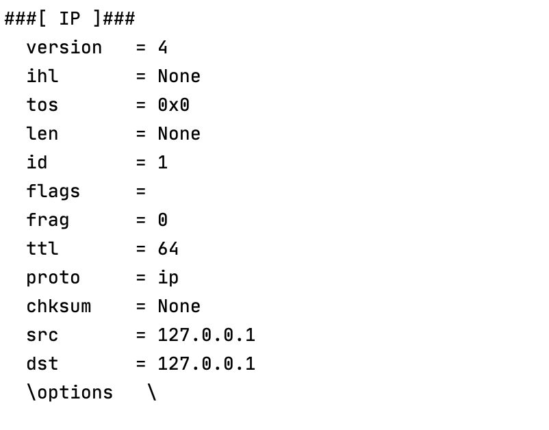
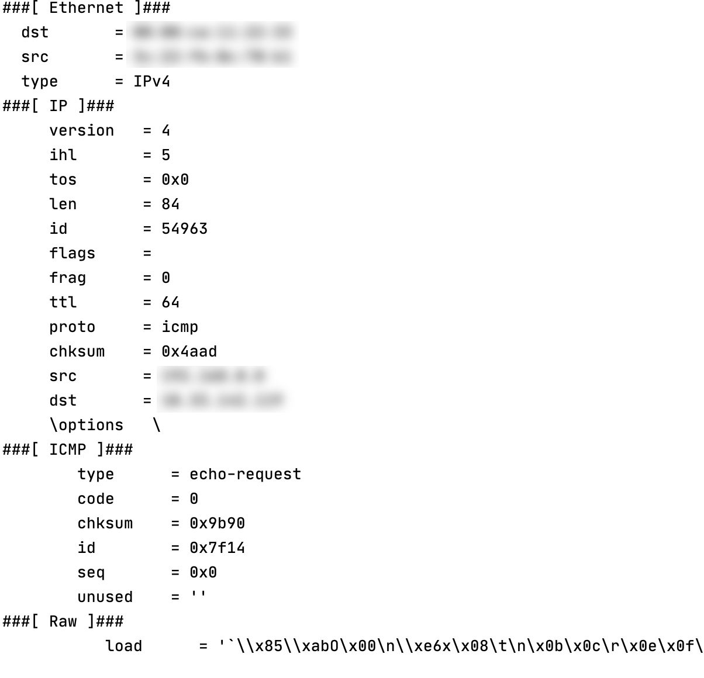
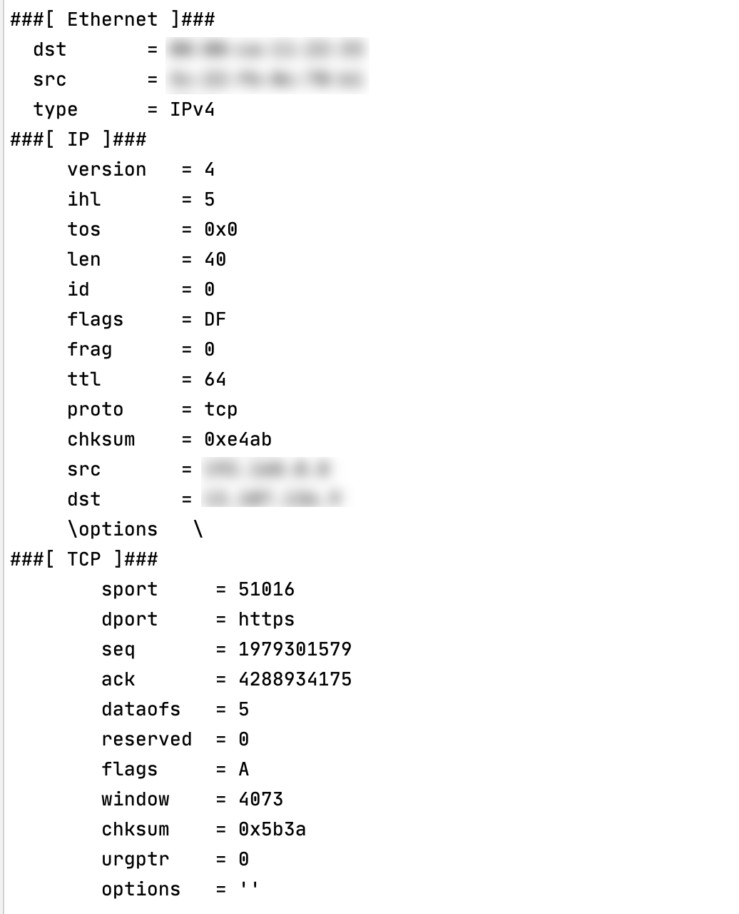
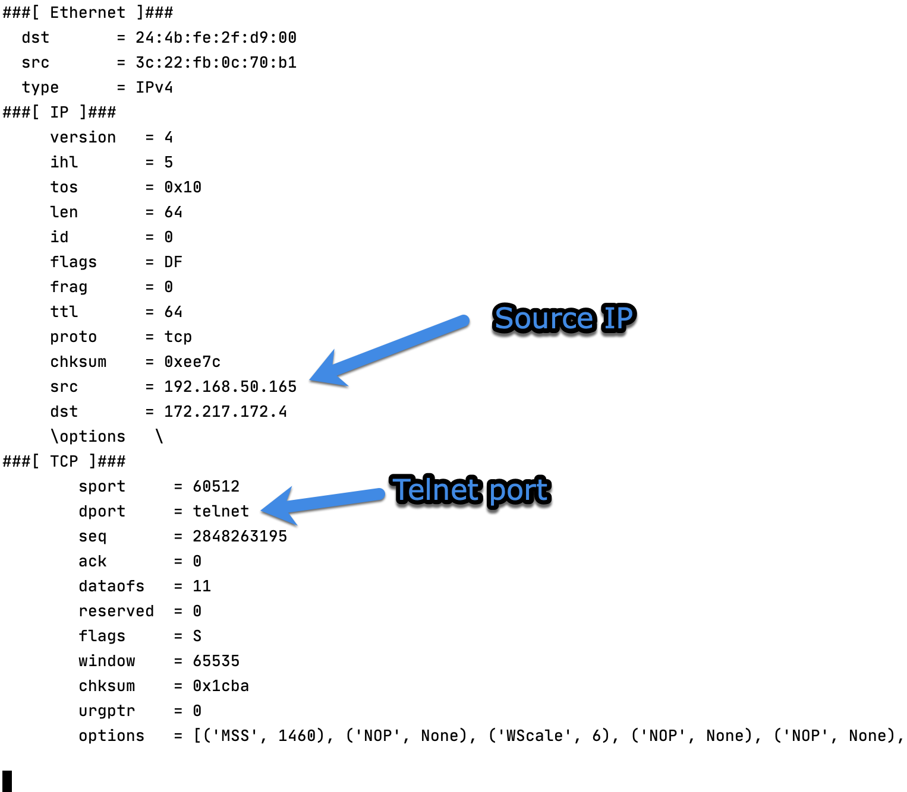
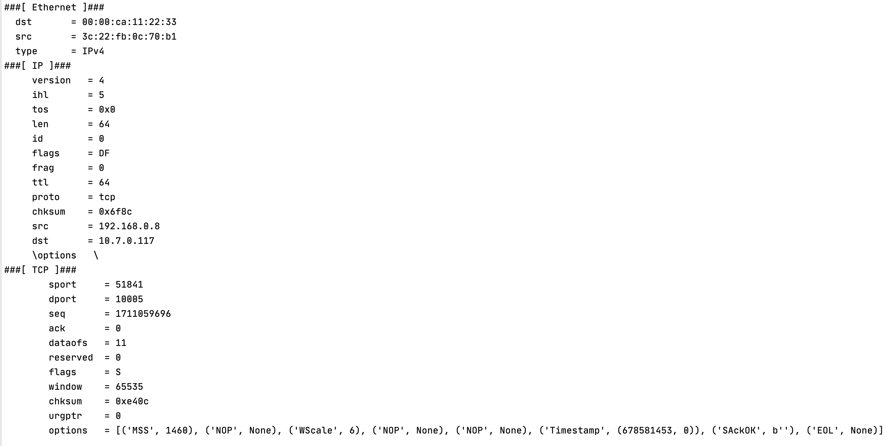
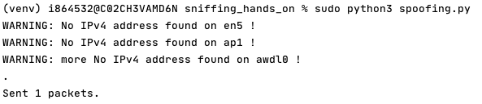
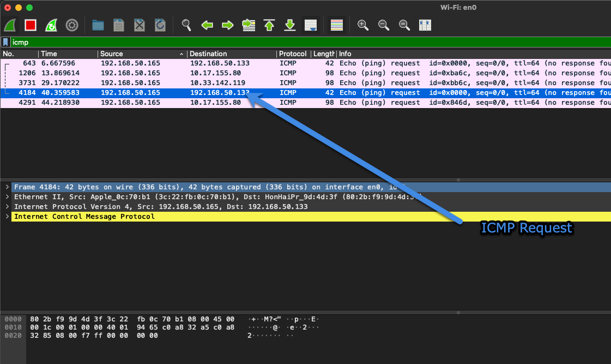

# Sniffing hands on.
Roger Ramírez Espejo.<br />
Software engineer, architect and enthusiast.
## Table of contents.

## Introduction.
This lab shows the usage of `scapy` library which will be used to display packets information and understand a bit more in dept use cases for this tools.

## Sniffer asking for IP Address of the machine.
Sniffer that shows the address of the machine: 
```
from scapy.all import *

a = IP()
a.show()
```
Result:


## Sniffer script with filtering `ICMP` Packages
Script:
```
from scapy.all import *

def print_pkt(pkt):
    pkt.show()
pkt = sniff(filter='icmp', prn=print_pkt)
```
Result:



## Sniffer script with filtering `TCP` Packages
Script:
```
from scapy.all import *

def print_pkt(pkt):
    pkt.show()
pkt = sniff(filter='tcp', prn=print_pkt)
```
Result




## TCP Packets from IP `192.168.0.6` and port `23`
Script:

```
from scapy.all import *

def print_pkt(pkt):
    pkt.show()
pkt = sniff(filter='tcp and src 192.168.50.165 and port 23', prn=print_pkt)
```

Result:

In first instance I couldn't capture any traffic because not traffic was generated in that port. But after runnin `telnet www.google.com` traffic could be captured:



## TCP Packets from subnet `10.0.0.0/8`
Script:
```
from scapy.all import *

def print_pkt(pkt):
    pkt.show()
pkt = sniff(filter='tcp and net 10.0.0.0/8', prn=print_pkt)
```
Results:




## Spoofing ICMP Packets
Script:
```
from scapy.all import *
from scapy.layers.inet import IP, ICMP

a = IP()
a.dst = '192.168.50.133'
b = ICMP()
p = a/b
send(p)
``` 

Request sent:

Wireshark tracking:

